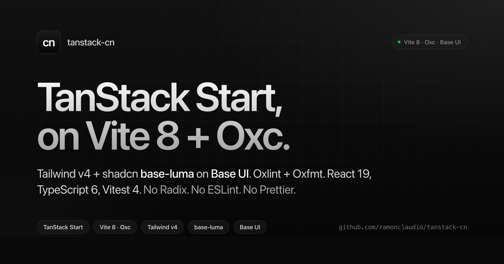

# tanstack-cn



TanStack Start on the latest majors. Vite 8 Rolldown+Oxc, Tailwind v4 + shadcn/ui base-luma on Base UI, Oxlint+Oxfmt. No Radix, no ESLint, no Prettier.

[Live demo](https://tanstack-cn.vercel.app) · [Use this template](https://github.com/ramonclaudio/tanstack-cn/generate)

```bash
bunx degit ramonclaudio/tanstack-cn my-app
cd my-app
bun install
bun run dev
```

## Why this exists

Every TanStack Start + shadcn starter on GitHub ships last year's choices: Radix, ESLint, Prettier, Webpack-era Vite. This one doesn't. Latest majors across the board, SEO and security plumbing wired, nothing to strip out.

## Stack

- TanStack Start + TanStack Router with file-based routing
- Vite 8 with Rolldown and Oxc plugins
- Nitro 3 for SSR output
- React 19 with the automatic JSX transform
- TypeScript 6, `strict`, `verbatimModuleSyntax`
- Tailwind CSS v4 via `@tailwindcss/vite`
- shadcn/ui `base-luma` theme on `@base-ui/react` (not Radix)
- HugeIcons + Geist Variable font
- Oxlint 1.59 with 232 rules across 8 native plugins, type-aware via `oxlint-tsgolint`
- Oxfmt with native import sorting, Tailwind class sorting, package.json field sorting
- Vitest 4 + `@testing-library/react` + jsdom
- Sonner toasts, theme provider, web vitals reporter
- Bun as runtime and package manager

## What's wired

### UI and routing

- `/` demo route that exercises Button, Card, Alert, InputGroup, Kbd, Empty, Separator, Sonner
- Light/dark/system theme with no-flash script in `src/components/theme-provider.tsx`
- Error boundary and 404 route hooked into the root

### SEO and social

- `src/lib/seo.ts` helper: absolute og:image, og:url, og:image:width/height, twitter:card auto-promotion
- Canonical link, `og:site_name`, full Twitter meta, JSON-LD `@graph` (WebSite + SoftwareSourceCode + Person)
- OG image: 2400×1260 PNG (2x of 1200×630). Retina-crisp, under 500KB, unfurls on X, Facebook, LinkedIn, Discord, Slack, iMessage
- `public/sitemap.xml`, `public/robots.txt` with AI training crawler opt-outs (GPTBot, ClaudeBot, CCBot, Google-Extended, Applebot-Extended, Bytespider, meta-externalagent, etc.)

### Icons and PWA

- `favicon.svg` (primary) + multi-size `favicon.ico` fallback
- `apple-touch-icon.png` (180×180)
- `manifest.webmanifest` with separate `any`, `maskable`, and `monochrome` icons, plus wide + narrow screenshots and shortcuts
- `theme-color` with per-scheme `media` queries (bypasses TanStack head dedup by rendering in root JSX)
- `color-scheme`, `mobile-web-app-capable`, `apple-mobile-web-app-title`

### Launch baseline

- Nitro `routeRules` in `vite.config.ts` emit platform-agnostic security headers on every preset (Vercel, Cloudflare, Netlify, Node, Bun): `Strict-Transport-Security`, `X-Content-Type-Options`, `X-Frame-Options`, `Referrer-Policy`, `Permissions-Policy` (camera/mic/geo/browsing-topics/interest-cohort off), `Cross-Origin-Opener-Policy`, `Cross-Origin-Resource-Policy`, `Origin-Agent-Cluster`
- Speculation Rules API: internal links prerender on 200ms hover (instant nav)
- Skip link, `<main id="main">` landmark, `prefers-reduced-motion` respected globally
- `public/.well-known/security.txt` per RFC 9116
- `public/llms.txt` + `public/llms-full.txt` for Claude, Perplexity, ChatGPT Search
- `env.example` documenting the `VITE_SITE_URL` pattern, typed via `src/vite-env.d.ts`
- GitHub Actions CI: typecheck, lint, fmt:check, test, build
- Dependabot weekly grouped updates (TanStack, Base UI, HugeIcons, testing, oxc, react, tailwind, dev-tools)

## Scripts

| Script                       | What it does                                       |
| ---------------------------- | -------------------------------------------------- |
| `bun run dev`                | Vite 8 dev server with HMR on `:3000`              |
| `bun run build`              | `tsc --noEmit && vite build`                       |
| `bun run start`              | Nitro SSR server from `.output/`                   |
| `bun run preview`            | `vite preview`                                     |
| `bun run typecheck`          | `tsc --noEmit`                                     |
| `bun run lint`               | `oxlint`                                           |
| `bun run lint:fix`           | `oxlint --fix` (safe fixes only)                   |
| `bun run lint:fix:suggest`   | `oxlint --fix --fix-suggestions`                   |
| `bun run lint:fix:dangerous` | `oxlint --fix --fix-suggestions --fix-dangerously` |
| `bun run fmt`                | `oxfmt`                                            |
| `bun run fmt:check`          | `oxfmt --check`                                    |
| `bun run test`               | `vitest run`                                       |
| `bun run test:watch`         | `vitest`                                           |
| `bun run clean`              | Trash `node_modules`, build artifacts, `.DS_Store` |

## Adding shadcn components

```bash
bunx shadcn@latest add sheet dialog tabs
```

Components land in `src/components/ui/`. Import via the `@/` alias:

```tsx
import { Sheet, SheetContent, SheetTrigger } from "@/components/ui/sheet"
```

The `base-luma` style is already pinned in `components.json`, so every new component picks it up automatically.

## Before you publish

One search-and-replace across the repo swaps all the placeholder branding:

```bash
grep -r "ramonclaudio/tanstack-cn\|tanstack-cn.vercel.app" --include='*.{ts,tsx,json,md,xml,txt,webmanifest}' -l
```

Files to update:

- `src/lib/site.ts`: `SITE_URL`, `SITE_NAME`, `SITE_TITLE`, `SITE_DESCRIPTION`
- `package.json`: `name`, `description`, `author`, `homepage`, `repository`, `bugs`, `keywords`
- `public/robots.txt`: `Sitemap:` line
- `public/sitemap.xml`: `<loc>` entries
- `public/.well-known/security.txt`: `Contact:` and `Canonical:`
- `env.example`, `README.md`

Or set `VITE_SITE_URL` in your `.env` and the SEO helper picks it up at build time.

## Project structure

```
src/
├── components/
│   ├── default-catch-boundary.tsx   # router error boundary
│   ├── devtools.tsx                 # TanStack devtools (dev only)
│   ├── not-found.tsx                # 404 page
│   ├── theme-provider.tsx           # light/dark/system with no-flash script
│   ├── theme-toggle.tsx             # dropdown toggle using HugeIcons
│   ├── web-vitals.tsx               # CLS/FID/LCP/INP reporter
│   └── ui/                          # shadcn/ui base-luma primitives
├── lib/
│   ├── report-web-vitals.ts
│   ├── seo.ts                       # head meta helper
│   ├── seo.test.ts
│   ├── site.ts                      # SITE_URL, SITE_NAME, SITE_TITLE, SITE_DESCRIPTION
│   ├── utils.ts                     # cn() class merger
│   └── utils.test.ts
├── routes/
│   ├── __root.tsx                   # root layout, head, theme, Toaster, skip link
│   └── index.tsx                    # demo homepage
├── router.tsx
├── routeTree.gen.ts                 # auto-generated by TanStack Router
├── styles.css                       # Tailwind v4 + base-luma theme + reduced-motion
└── vite-env.d.ts                    # typed import.meta.env
```

## Configuration

| File               | Purpose                                                        |
| ------------------ | -------------------------------------------------------------- |
| `vite.config.ts`   | Vite 8 + Nitro SSR + TanStack Start plugin order               |
| `tsconfig.json`    | TypeScript 6 strict, `isolatedModules`, `verbatimModuleSyntax` |
| `.oxlintrc.json`   | Oxlint rules, plugins, overrides, type-aware linting           |
| `.oxfmtrc.json`    | Oxfmt formatter with import and Tailwind sorting               |
| `vitest.config.ts` | jsdom environment + React CJS interop via `deps.optimizer`     |
| `components.json`  | shadcn `base-luma` theme config                                |

## Deploying

Nitro auto-detects the preset. Push and import on any of:

- Vercel
- Cloudflare Pages / Workers
- Netlify
- Node (default)
- Bun
- Deno

Security headers ship from Nitro `routeRules` at runtime, so every preset gets the same response headers without extra config files.

```bash
bun run build
bun run start   # Node preset
```

### Optional: platform-specific analytics

No analytics or RUM dep is bundled. If you deploy to Vercel and want their free tools:

```bash
bun add @vercel/speed-insights @vercel/analytics
```

Then mount `<SpeedInsights />` and `<Analytics />` in `src/routes/__root.tsx`. For Cloudflare, use their Web Analytics script. For Plausible/Umami/PostHog, drop their snippet in the root route's `scripts` array.

## CI

`.github/workflows/ci.yml` runs five gates on every push to `main` and every PR:

1. `typecheck` (TypeScript 6)
2. `lint` (`oxlint --format=github`)
3. `fmt:check` (`oxfmt`)
4. `test` (Vitest 4)
5. `build` (Vite 8 + Rolldown + Oxc + Nitro)

## License

MIT © [Ramon Claudio](https://github.com/ramonclaudio)
